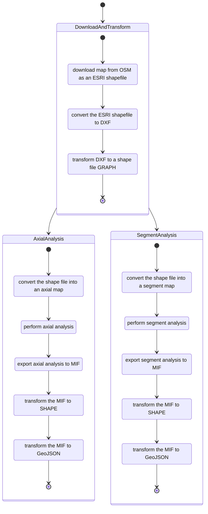

## Space Syntax
For creating depthmap axial and segment analysis on maps.

Based on:
  - [osmnx](https://github.com/gboeing/osmnx) for openstreat map downloading
  - [geopandas](https://geopandas.org) for conversion
  - [depthmapX](https://www.ucl.ac.uk/bartlett/architecture/research/space-syntax/depthmapx) for spatial analysis

## Expected running time
The computations are CPU heavy and generally not multi-thread capable. 
For reference here are some orientational running times so that you can an idea on what kind of analysis timeline to expect:

|City, Country     |Time in seconds|Time in minutes |Time in hours     |Time in Days       |
|------------------|---------------|----------------|------------------|-------------------|
|Alicante, Spain   |2852           |47,5333333333333|0,792222222222222 |0,0330092592592593 |
|Wroclaw, Poland   |16500          |275             |4,58333333333333  |0,190972222222222  |
|Montreal, Canada  |46265          |771,083333333333|12,8513888888889  |0,535474537037038  |
|Medellin, Colombia|33660          |561             |9,35              |0,389583333333333  |
|Hamburg, Germany  |106140         |1769            |29,4833333333333  |1,22847222222222   |
|Berlin, Germany   |165709         |2761,81666666667|46,0302777777778  |1,91792824074074   |
|Balchik, Bulgaria |100            |1,66666666666667|0,0277777777777778|0,00115740740740741|

* The analysis ran on a Intel(R) Core(TM) i7-6900K CPU @ 3.20GHz with 32GB of RAM

### Operation steps as a state diagram

### Algorithm pseudocode:
1. download map from OSM as an ESRI shapefile
1. convert the ESRI shapefile to DXF
1. transform DXF to a shape file GRAPH
1. convert the shape file into an axial map
    1. performing axial analysis
    1. exporting axial analysis to MIF
    1. transform the MIF to SHAPE
    1. transform the MIF to GeoJSON
1. convert the shape file into a segment map
    1. performing segment analysis
    1. exporting segment analysis to MIF
    1. transform the MIF to SHAPE
    1. transform the MIF to GeoJSON

### License
[GNU General Public License v3.0](./LICENSE)
